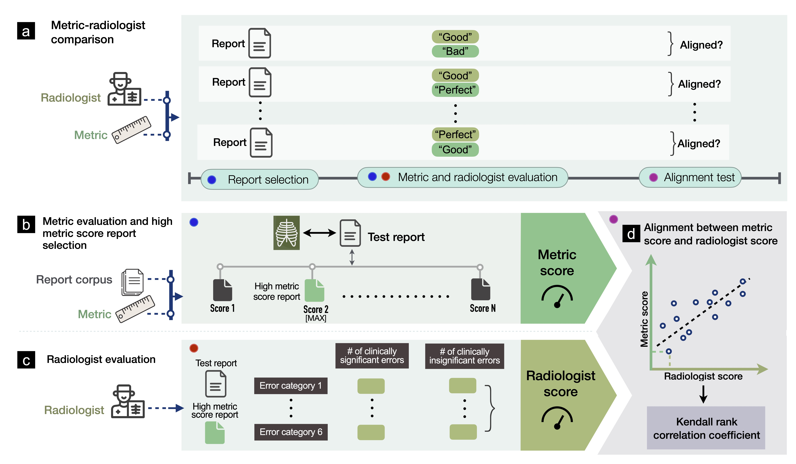

[](https://zenodo.org/badge/latestdoi/486461621)

# Evaluating Progress in Automatic Chest X-Ray Radiology Report Generation



Repository referenced in the paper "[Evaluating Progress in Automatic Chest 
X-Ray Radiology Report Generation](https://www.medrxiv.org/content/10.1101/2022.08.30.22279318v1)". This repository provides code for computing metric scores for radiology report evaluation. The metrics are:
* BLEU
* BERTscore
* CheXbert labeler vector similarity
* RadGraph entity and relation F1
* Composite metric RadCliQ


## Table of Contents
* [Prerequisites](#prerequisites)
* [Requirements](#requirements)
* [Usage](#usage)
* [License](#license)
* [Citing](#citing)


<a name="prerequisites"></a>

# Prerequisites
To install the dependencies, run the following command with Python 3.7:
```
pip install -r requirements.txt
```

<a name="requirements"></a>

# Requirements
Ground Truth and Predicted reports must be arranged in the same order in a
column named "report" in two CSV files. The CSVs should also contain a
corresponding "study_id" column that contains unique identifies for the reports.

In `config.py`, set `GT_REPORTS` and `PREDICTED_REPORTS` to paths to the CSVs.
Set `OUT_FILE` to the desired path for the output metric scores.


# Note about removed integrations
The repository previously included integrations for CheXbert (semantic embedding) and
RadGraph (DyGIE++). Those folders were removed from this workspace and the
corresponding model-based metrics are now disabled by default. If you need to
re-enable them, restore the relevant model files and update `config.py` with
the correct model paths. The repo still supports text-based metrics such as
BLEU, ROUGE and BERTScore.

## Supported metrics (note)
This repository currently supports the following metrics by default: BLEU,
BERTScore, ROUGE and bounding-box IoU. Model-based metrics that require
external checkpoints (CheXbert, RadGraph) are disabled until the corresponding
models are restored.


<a name="usage"></a>

# Usage
```
from CXRMetric.run_eval import calc_metric
calc_metric(gt_reports, predicted_reports, out_file, use_idf)
```

# Evaluation Metrics and Protocol

This repository computes a set of metrics that together assess language fidelity, clinical correctness, and image-grounded localization for generated chest X-ray reports. Below are concise definitions and the recommended evaluation protocol to reproduce the benchmark results reported for CXRReportGen.

Table 1: Key Evaluation Metrics for CXRReportGen Outputs

| Metric | What it Measures | Higher Score Meaning |
|---|---|---|
| Precision / Recall (P/R) (per finding) | Fraction of predicted findings that are correct (Precision) and fraction of true findings that are captured (Recall), often aggregated across all cases. Typically combined into F1 score for summary. | Higher precision = fewer false findings; higher recall = fewer missed findings. Both high = model outputs are accurate and comprehensive. |
| F1 Score (micro) | Combined measure of Precision and Recall. Micro-averaged F1 treats all findings equally across the dataset (suitable for multi-label evaluation). Often computed for specific label sets (e.g. CheXpert). | Closer to 100% means balanced high precision and recall – the model is identifying findings correctly and not missing many. |
| CheXpert F1-14 (micro) | F1 on 14 common chest pathology labels (using a labeling tool on reports). Assesses coverage of key diagnoses (e.g., edema, pneumonia, pneumothorax, etc.). | Higher implies the model’s report mentions the same abnormalities as the reference more often. |
| RadGraph F1 | F1 score for clinical entities and relations in the report. Evaluates factual correctness of clinical content (findings and their anatomical locations). | Higher = model is correctly describing the findings and anatomy as a radiologist would, with correct relationships (fewer clinical factual errors). |
| ROUGE-L | Overlap of sequences between generated and reference report (Longest Common Subsequence). Focuses on recall of content. | Higher = model covered more of the reference report’s content. |
| BLEU-4 | N-gram overlap between generated and reference text (up to 4-word phrases). Indicates fluency and phrasing similarity. | Higher = output text closely matches reference phrasing. |
| Box-Completion Precision | Correctness of predicted bounding boxes (what fraction correspond to true findings). | Higher = model’s highlighted regions on X-ray are usually relevant (few false highlights). |
| Box-Completion Recall | Completeness of predicted boxes (what fraction of true finding locations were detected). | Higher = model found most of the actual findings in the image (few misses). |

Evaluation Protocol (recommended)

1. Prepare Ground Truth: Collect a set of chest X-ray studies with expert-written reports. Two suitable datasets are commonly used: the MIMIC-CXR test set and the GR-Bench dataset. Ensure these reference reports are segmented if needed (e.g., identify the “Findings” section). If evaluating bounding boxes, ensure ground truth boxes are available for findings (as provided in GR-Bench).

2. Run CXRReportGen on the Test Set: Using the model in a controlled development environment (e.g., deployed on Azure ML or local inference), generate reports for each X-ray. Include both frontal and lateral images if the dataset provides both – the model accepts an optional lateral view input which can improve findings. Also provide any available textual context (indication, technique, etc.) if applicable, as the model input allows these fields.

3. Compute Text Similarity Metrics (BLEU, ROUGE): Use standard NLG evaluation scripts or libraries to compare each generated report with the reference report, computing BLEU-4 and ROUGE-L for each, then average over the test set. These metrics will give a general sense of how close the AI reports are to what radiologists wrote, in terms of wording and content overlap.

4. Compute Clinical Label Metrics (CheXpert F1): Use a CheXpert labeler or similar tool on both the generated and true reports to extract binary labels for a set of pathologies. Then compute precision, recall, F1 for each label and aggregate (micro-average) across all labels and samples. Pay attention to cases of uncertainty or negation in reports – ensure the labeling tool accounts for “no evidence of X” appropriately (the CheXpert labeler does). Report overall micro-F1 and optionally per-label performance to identify systematic weaknesses.

5. Compute RadGraph F1: Use the RadGraph evaluation script to analyze the generated and reference reports. Extract entities and relations from both reports and determine matches. The output is an F1 score that penalizes missing or hallucinated findings in the context of the report’s factual content.

6. Evaluate Bounding Box Alignment: For cases with ground truth bounding boxes (such as GR-Bench), evaluate each predicted box by calculating overlap (e.g. Intersection over Union). Determine matches with a threshold (e.g. IoU > 0.5). Calculate precision = (true positive boxes / predicted boxes) and recall = (true positive boxes / ground truth boxes) across the dataset. Visually inspect a sample of images with overlaid boxes to qualitatively assess correspondence between boxes and described findings.

7. Statistical Significance (optional): For comparisons (e.g., between models or after fine-tuning), consider bootstrap resampling or other statistical tests for metrics like BLEU or F1 to determine whether observed differences are meaningful.

The chosen metrics cover language fidelity, clinical accuracy, and visual localization — together providing a comprehensive picture of model performance. Follow the procedure above to quantify where CXRReportGen performs well and where it needs improvement before integration into downstream applications.

# Benchmark Results on Standard Datasets

Using the above metrics, CXRReportGen benchmark results reported on two test sets are summarized below.

Table 2: CXRReportGen Benchmark Performance

| Metric | MIMIC-CXR Test (Findings Generation) | GR-Bench Test (Grounded Reporting) |
|---|---:|---:|
| CheXpert F1-14 (micro) | 59.1 | 60.0 |
| CheXpert F1-5 (micro) | 59.7 | – |
| RadGraph F1 | 40.8 | 55.6 |
| ROUGE-L | 39.1 | 56.6 |
| BLEU-4 | 23.7 | – |
| Box-Completion Precision | – | 71.5% |
| Box-Completion Recall | – | 82.0% |

These benchmark numbers illustrate typical performance ranges and demonstrate how combining language and clinical-structure metrics yields a fuller evaluation of generated radiology reports.


<a name="license"></a>

# License
This repository is made publicly available under the MIT License.


<a name="citing"></a>

# Citing
If you are using this repo, please cite this paper:
```
@article {Yu2022.08.30.22279318,
	author = {Yu, Feiyang and Endo, Mark and Krishnan, Rayan and Pan, Ian and Tsai, Andy and Reis, Eduardo Pontes and Fonseca, Eduardo Kaiser Ururahy Nunes and Ho Lee, Henrique Min and Abad, Zahra Shakeri Hossein and Ng, Andrew Y. and Langlotz, Curtis P. and Venugopal, Vasantha Kumar and Rajpurkar, Pranav},
	title = {Evaluating Progress in Automatic Chest X-Ray Radiology Report Generation},
	elocation-id = {2022.08.30.22279318},
	year = {2022},
	doi = {10.1101/2022.08.30.22279318},
	publisher = {Cold Spring Harbor Laboratory Press},
	URL = {https://www.medrxiv.org/content/early/2022/08/31/2022.08.30.22279318},
	eprint = {https://www.medrxiv.org/content/early/2022/08/31/2022.08.30.22279318.full.pdf},
	journal = {medRxiv}
}
```
